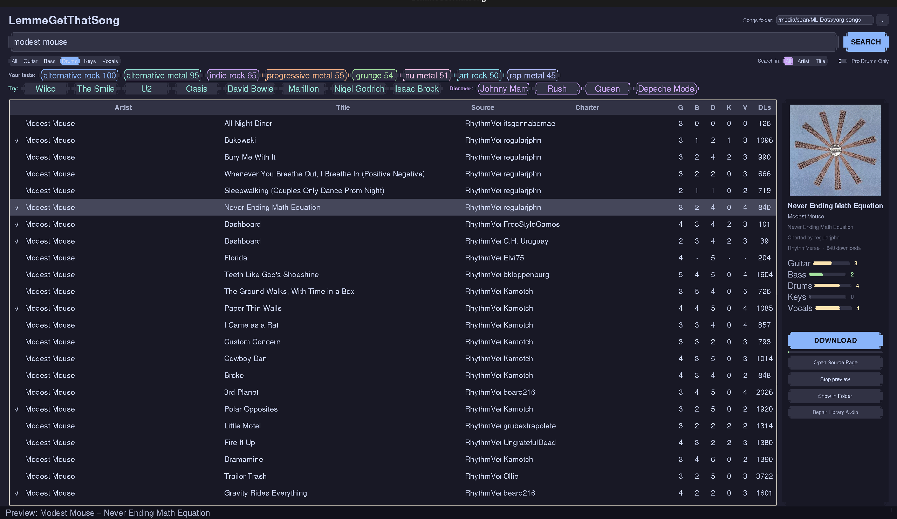

# LemmeGetThatSong

A desktop chart downloader for [YARG](https://yarg.in). Searches Chorus Encore,
RhythmVerse, and YARG Charts at once, and drops charts straight into your songs
folder.



## What it does

- **One search, three sources.** Chorus Encore, RhythmVerse, and YARG Charts
  queried in parallel, results merged and deduplicated.
- **Difficulty at a glance.** Guitar / bass / drums / keys / vocals ratings per
  chart, with pro-drums filtering.
- **Direct downloads.** Pulls `.sng` straight from Encore's CDN instead of
  bouncing through Google Drive, so no throttling and no confirm pages.
- **Handles Rock Band CONs.** Detects the container format from magic bytes
  rather than trusting the file extension, unpacks CONs into the ex-CON layout
  YARG expects, and flags files YARG can't read.
- **Taste-based recommendations.** Learns from what you download and suggests
  artists via MusicBrainz.

## Install

Grab the binary for your platform from
[Releases](../../releases). No Python needed.

**Linux**

```bash
chmod +x LemmeGetThatSong-linux-x64
./LemmeGetThatSong-linux-x64
```

**Windows** — run the `.exe`. SmartScreen will warn you because the binary is
unsigned; "More info" then "Run anyway".

### From source

```bash
git clone https://github.com/YOURNAME/LemmeGetThatSong
cd LemmeGetThatSong
pip install -r requirements.txt
python yarg_gui.py
```

Linux also needs Tk: `sudo apt install python3-tk`

## Encrypted Rock Band audio (optional)

Some Rock Band CONs — especially ones converted from Wii — ship with encrypted
`.mogg` audio. YARG can't read those and silently skips the song, which is
confusing when the download appeared to work.

This app detects that case and tells you. To actually repair it, install
[Onyx Music Game Toolkit](https://github.com/mtolly/onyx/releases) separately.


Once installed, put it anywhere on `PATH`, or in an `onyx/` folder next to the
executable, or set `ONYX_BIN=/path/to/onyx`. Extracted AppImages are found
automatically.

Check what's detected in your library:

```bash
python mogg_check.py /path/to/your/songs
```

Everything else works without Onyx. Most charts — anything `.sng` or `.zip`,
which is the large majority — never need it.

## Notes

- Charts are made by the charting community. Support them.
- This tool downloads publicly available charts. It doesn't host anything.

## License

MIT — see [LICENSE](LICENSE).
